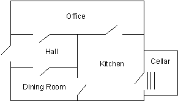

# 第3章-事实
> 事实（`facts`）是`prolog`中最简单的谓词（`predicate`）。它和关系数据库中的记录十分相似。在下一章中我们会把事实作为数据库来搜索。

> 谓词：` Prolog`语言的基本组成元素，可以是一段程序、一个数据类型或者是一种关系。它由谓词名和参数组成。两个名称相同而参数的数目不同的谓词是不同的谓词。

事实的语法结构如下：

`pred(arg1, arg2, ... argN).`

其中`pred`为谓词的名称。`arg1`，`...`为参数，共有`N`个。‘`.`’是所有的`Prolog`子句的结束符。没有参数的谓词形式如下：
```
pred.
```
参数可以是以下四种之一：

- 整数（`integer)`: 绝对值小于某一个数的正数或负数。
- 原子（`atom`）: 由小写字母开头的字符串。
- 变量（`variable`）: 由大写字母或下划线（`_`）开头。
- 结构（`structure`）: 在以后的章节介绍。

不同的`Prolog`还增加了一些其他的数据类型，例如浮点数和字符串等。

`Prolog`字符集包括：大写字母，`A-Z`；小写字母，`a-z`；数字，`0-9;+-/\^,.~:.?#$`等。

原子通常是`字母`和`数字`组成，开头的字符必须是`小写字母`。例如：
```
hello 
twoWordsTogether 
x14 
```
为了方便阅读，可以使用`下划线`把单词分开。例如：
```
a_long_atom_name`
z_23`
```
下面的是`不合法`的原子，
```
no-embedded-hyphens 
123nodigitsatbeginning 
Nocapsfirst 
```
下划线不能放在`最前面`

使用`单引号`扩起来的字符集都是合法的原子。例如：
```
'this-hyphen-is-ok'
'UpperCase'
'embedded blanks'
```
下面的由`符号`组成的也是合法的原子：
```
>,++
```
变量和原子相似，但是开头字符是`大写字母或是下划线`。例如：
```
X 
Input_List
```
下划线开头的都是变量
```
Z56 
```
有了这些基本的知识，我们就可以开始编写`事实`了。事实通常用来储存程序所需的数据。例如，某次商业买卖中的顾客数据。`customer/3`。（`/3`表示`customer`有三个参数）
```prolog
customer('John Jones', boston, good_credit). 
customer('Sally Smith', chicago, good_credit).
```
必须使用`单引号`把`顾客名`引起来，因为它们是由大写字母开头的，并且中间有空格。

再看一个例子，视窗系统使用事实储存不同的窗口信息。在这个例子中参数有窗口名称和窗口的位置坐标。
```
window(main, 2, 2, 20, 72). 
window(errors, 15, 40, 20, 78). 
```
某个医疗专家系统可能有如下的疾病数据库。
```
disease(plague, infectious). {疾病（瘟疫，有传染性）}
```

> `Prolog`的解释器提供了动态储存事实和规则的方法，并且也提供了访问它们的方法。数据库的更新是通过运行‘`consult`’或‘`reconsult`’命令。我们也可以直接在解释器中输入谓词，但是这些谓词不会被储存到硬盘上。 

### 寻找**Nani**

下面我们正式开始`“寻找Nani”`游戏的编写。我们从定义基本的事实开始，这些事实是本游戏的基本的数据库。它们包括：

- 房间和它们的联系
- 物体和它们的位置
- 物体的属性
- 玩家在游戏开始时的位置

`寻找Nani`游戏的的房间格局如下:
<div align=center style="align:center">
    
</div>

首先我们使用`room/1`谓词定义房间，一共有五条子句，它们都是事实。
```prolog
room(kitchen). 
room(office). 
room(hall). 
room('dining room'). 
room(cellar). 
```
我们使用具有两个参数的谓词来定义物体的位置。第一个参数代表物体的名称，第二个参数表示物体的位置。开始时，我们加入如下的物体。
```prolog
location(desk, office).
location(apple, kitchen).
location(flashlight, desk).
location('washing machine', cellar). 
location(nani, 'washing machine').
location(broccoli, kitchen). 
location(crackers, kitchen).
location(computer, office).
```

> 注意：我们定义的那些符号，例如：`kitchen`、`desk`等对于我们是有意义的，可是它们对于`Prolog`是没有任何意义的，完全可以使用任何符号来表示房间的名称。

谓词`location/2`的意思是“第一个参数所代表的物体位于第二个参数所代表的物体中”。`Prolog`能够区别`location(sink, kitchen)`和`location(kitchen, sink)`。因此，参数的顺序是我们定义事实时需要考虑的一个重要问题。

下面我们来表达房间的联系。使用`door/2`来表示两个房间有门相连，这里遇到了一个小小的困难：
```prolog
door(office, hall).
```
我们想要表达的意思是，`office`和`hall`之间有一个门。可是由于`Prolog`能够区分`door(office, hall)`和`door(hall, office)`，所以如果我们想要表达一种双向的联系，就必须把每种联系都定义一遍。
```prolog
door(office, hall). 
door(hall, office). 
```
参数的顺序对定义物体的位置有帮助，可是在定义房间的联系时却带来了麻烦。我们不得不把每个房门都定义两次！

> 在这一章里，只定义单向的门，以后会很好地解决此问题的。
```prolog
door(office, hall). 
door(kitchen, office).
door(hall, 'dining room'). 
door(kitchen, cellar).
door('dining room', kitchen).
```
下面定义某些物体的属性，
```prolog
edible(apple). 
edible(crackers). 
tastes_yucky(broccoli). 
```
最后，定义手电筒（由于是晚上，玩家必须想找到手电筒，并打开它才能到那些关了灯的房间）的状态和玩家的初始位置。
```prolog
turned_off(flashlight).
here(kitchen).
```
好了，到此你应该学会了如何使用`Prolog`的事实来表达数据了。