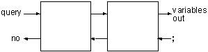
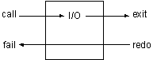

# 第5章-混合查询

我们可以把简单的查询连接起来，组成一些较复杂的查询。例如，如果我们想知道厨房里能吃的东西，就可以向`Prolog`进行如下的询问。
```js
?- location(X, kitchen), edible(X). 
```
简单的查询只有一个目标，而混合查询可以把这些目标连接起来，从而进行较为复杂的查询。上面的连接符号`','`是并且的意思。

上面的式子用语言来描述就是“寻找满足条件的`X`，条件是：`X`在厨房里，并且`X`能吃。”如果某个变量在询问中多次出现，则此变量在所有出现的位置都必须绑定为相同的值。所以上面的查询只有找到某一个`X`的值，使得两个目标都成立时，才算查询成功。

每次查询所使用的变量都是局部的变量，它只在本查询中有意义，所以当我们进行了如下的查询后，
```js
?- location(X, kitchen), edible(X).
X = apple ;
X = crackers ; 
no
```
查询结果中没有`broccoli`（椰菜），因为我们没有把它定义为可吃的东西。此后，还可以用`X`进行其他的查询。
```js
?- room(X).
X = kitchen ;
X = office ;
X = hall ; 
...;
no 
```
除了使用逻辑的方法理解混合查询外，还可以通过分析程序的运行步骤来理解。用程序的语言来说就是“首先找到一样位于厨房的东西，然后判断它能否食用，如果不能，就到厨房里找下一样东西，再判断能否食用。一直如此重复，直到找到答案或把厨房的东西全部查完为止。”

请参照下图来理解。

<div align=center style="align:center">
    
</div>

调用查询后，程序将按照下面的步骤运行，请参照上图来理解。

- 搜索第一个目标，如果成功转到`2`，如果失败则回答`'no'`，查询结束。
- 搜索第二个目标，如果成功转到`3`，如果失败转到`1`。
- 把绑定的变量的值输出。用户输入`';'`后转到`2`。

上面的例子中只有一个变量，下面我们再来看一个有两个变量的例子。
```js
?- door(kitchen, R), location(T,R).
R = office
T = desk ;

R = office
T = computer ;

R = cellar
T = 'washing machine' ; 

no 
```
上面的查询用逻辑的语言来解释就是：“找房间`R`，使得从厨房到房间`R`有门相连，并且把房间`R`中的物品`T`(这里是房间`R`的所有物品）也找出来。”

下面是此查询的单步运行过程。
```js
Goal: door(kitchen, R), location(T,R)

1 CALL door(kitchen, R)
1 EXIT (2) door(kitchen, office)
2 CALL location(T, office)
2 EXIT (1) location(desk, office)
R = office 
T = desk ;

2 REDO location(T, office)
2 EXIT (8) location(computer, office)
R = office
T = computer ;

2 REDO location(T, office)
2 FAIL location(T, office)
1 REDO door(kitchen, R) 
1 EXIT (4) door(kitchen, cellar)
2 CALL location(T, cellar)
2 EXIT (4) location('washing machine', cellar)
R = cellar 
T = 'washing machine' ; 

2 REDO location(T, cellar)
2 FAIL location(T, cellar)
1 REDO door(kitchen, R) 
1 FAIL door(kitchen, R)
no  
```

### 内部谓词
讲了这么多了，我们还只是用到了`Prolog`的一些语法，完全没有使用`Prolog`提供的一些内部的函数，我把这些内部函数称为内部谓词。和其他的程序语言一样，`Prolog`也提供了一些基本的输入输出函数，下面我们要编写一个较复杂的查询，它能够找到所有厨房里能够吃的东西，并把它们列出来。而不是像以前那样需要人工输入`';'`。

要想完成上面的任务，我们首先必须了解内部谓词的概念。内部谓词是指已经在`Prolog`中事先定义好的谓词。在内存中的动态数据库中是没有内部谓词的子句的。当解释器遇到了内部谓词的目标，它就直接调用事先编好的程序。

内部谓词一般所完成的工作都是与逻辑程序无关的，例如输入输出的谓词。所以我们可以把这些谓词叫做非逻辑谓词。

但是这些谓词也可以作为`Prolog`的目标，所以它们也必须拥有和逻辑谓词相同的四个端口：`Call`、`Fail`、`Redo`和`Exit`。

下面介绍几个常用的输出谓词。

> `write/1`<br>
> 此谓词被调用时永远是成功的，并且它可以把它的参数作为字符串输出到屏幕上。当回溯时，它永远是失败，所以回溯是不会把已经写到屏幕上的字符又给删除的。

> `nl/0`<br>
> 此谓词没有参数，和`write`一样，从`Call`端口调用时总是成功的，从`Redo`端口回溯时总是失败的，它的作用是在屏幕上输出一个回车符。

> `tab/1`<br>
> 此谓词的参数是一个整数，它的作用是输出`n`个空格，`n`为它的参数。其控制流程与上面两个相同。

下图是一般情况下的`Prolog`目标的内部流程控制示意图。我们将使用此图和内部谓词的流程控制图相比较。
<div align=center style="align:center">
    
</div>
上图中左上角的菱形方块表示从`Call`端口进入目标时所进行的处理。它从某谓词的第一个子句开始搜索，如果匹配成功就到`Exit`端口，如果没有找到任何一个子句与目标匹配就转到`Fail`端口。

右下角的方块表示从`Redo`端口进入目标时所进行的处理，从最近一次成功的子句开始向下搜索，如果匹配成功就转到`Exit`端口，如果没有找个更多的子句满足目标就转到`Fail`端口。

`I/O`谓词的流程控制和上述的不同，它不会改变流程的方向，如果流程从它的左边进入，就会从它的右边流出；而如果从它的右边进入，则会从它的左边流出。请参考下图理解。

<div align=center style="align:center">
    
</div>

`I/O`谓词不会改变变量的值，但是它们可以把变量的值输出。

还有一个专门引起回溯的内部谓词`fail/0`，从它的名字不难看出，它的调用永远是失败的。如果`fail/0`从左边得到控制权，则它立即把控制权再传回到左边。它不会从右边得到控制，因为没法通过`fail/0`把控制权传到右侧。它的内部流程控制如下：

<div align=center style="align:center">
    
</div>

以前我们是靠使用`';'`来进入目标的`Redo`端口的，并且变量的值的输出是靠解释器完成的。现在有了上面几个内部谓词，我们就可以靠`I/O`谓词来显示变量的值，靠`fail`谓词来引起自动的回溯。

下面是此查询语句及其运行结果。
```js
?- location(X, kitchen), write(X) ,nl, fail.
apple 
broccoli
crackers 
no 
```
下面是此查询的流程图。

<div align=center style="align:center">
    
</div>

下面是此查询的单步调试过程。
```js
Goal: location(X, kitchen), write(X), nl, fail.
1 CALL location(X, kitchen)
1 EXIT (2) location(apple, kitchen) 
2 CALL write(apple)
apple
2 EXIT write(apple) 
3 CALL nl 

3 EXIT nl 
4 CALL fail 
4 FAIL fail
3 REDO nl
3 FAIL nl 
2 REDO write(apple) 
2 FAIL write(apple)
1 REDO location(X, kitchen)
1 EXIT (6) location(broccoli, kitchen)
2 CALL write(broccoli)
broccoli
2 EXIT write(broccoli)
3 CALL nl

3 EXIT nl
4 CALL fail
4 FAIL fail
3 REDO nl
3 FAIL nl
2 REDO write(broccoli)
2 FAIL write(broccoli)
1 REDO location(X, kitchen)
1 EXIT (7) location(crackers, kitchen)
2 CALL write(crackers) crackers
2 EXIT write(crackers) 
3 CALL nl 

3 EXIT nl
4 CALL fail
4 FAIL fail
3 REDO nl
3 FAIL nl 
2 REDO write(crackers) 
2 FAIL write(crackers)
1 REDO location(X, kitchen) 
1 FAIL location(X, kitchen)
no 
```

### after
下面请你分析一下，
```js
?- door(kitchen, R), write(R), nl, location(T,R), tab(3), write(T), nl, fail. 
```
的输出的结果是什么呢？