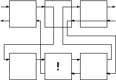

# 截断

直到目前为止，我们都一直在使用Prolog内建的回溯功能。使用此功能可以方便地写出结构紧凑的谓词来。

但是，并不是所有的回溯都是必须的，这时我们需要能够人工地控制回溯过程。Prolog提供了完成此功能的谓词，他叫做`cut`，使用符号！来表示。

`Cut`能够有效地剔除一些多余的搜索。如果在`cut`处产生回溯，它会自动地失败，而不去进行其它的选择。

下面我们将看看它的一些实际的功效。


<div align=center style="align:center">
    
</div>


请参照上图来理解`cut`的功能。当在回溯遇到`cut`时，它改变了回溯的流程，它直接把控制权传给了上一级目标，而不是它左边的目标。这样第一层的中间的那个目标以及第二层！左边的子目标都不会被Prolog重新满足。

下面我们将举个简单的例子来说明`cut`的作用。首先加入几条事实：
```prolog
data(one). 
data(two).
data(three).
```
下面是没有使用`cut`的情况：

```prolog
cut_test_a(X) :-
    data(X). 
cut_test_a('last clause').
```

下面是对上面的事实与规则的一次询问。

```prolog
?- cut_test_a(X), write(X), nl, fail. 
one
two
three 
last clause
no
```

我们再来看看使用了`cut`之后的情况。

```prolog
cut_test_b(X) :-
    data(X), !. 
cut_test_b('last clause').
```
```prolog
?- cut_test_b(X), write(X), nl, fail. 
one 
```

我们可以看到，由于在`cut_test_b(X)`子句加入了`cut`，`data/1`子目标与`cut_test_b`父目标都没有产生回溯。

下面我们看看把`cut`放到两个子目标中的情况。

```prolog
cut_test_c(X,Y) :-
    data(X), !, data(Y). 
cut_test_c('last clause'). 
```
```prolog
?- cut_test_c(X,Y), write(X-Y), nl, fail.
one - one 
one - two 
one - three 
no
```

`cut`抑制了其左边的子目标`data(X)`与`cut_test_c`父目标的回溯，而它右边的目标则不受影响。

`cut`是不符合纯逻辑学的，不过出于实用的考虑，它还是必须的。过多地使用`cut`将降低程序的易读性和易维护性。它就像是其它语言中的goto语句。

当你能够确信在谓词中的某一点只有一个答案，或者没有答案时，使用`cut`可以提高程序的效率，另外，如果在某种情况下你想让某个谓词强制失败，而不让它去寻找更多的答案时，使用`cut`也是个不错的选择。

下面将介绍使用`cut`的技巧。

# 使用Cut

为了让冒险游戏更加有趣，我们来编写一个小小的迷题。我们把这个迷题叫做`puzzle/1`。`puzzle`的参数是游戏中的某个命令，`puzzle`将判断这个命令有没有特殊的要求，并做出反应。

我们将在`puzzle/1`中见到cut的两种用法。我们想要完成的任务是：

如果存在`puzzle`，并且约束条件成立，就成功。 

如果存在`puzzle`，而约束条件不成立，就失败。 

`puzzle`，成功。 

在本游戏中的`puzzle`是要到`地下室（cellar）`中去，而玩家必须拥有手电筒，并且打开了，才能够进到地下室中。如果这些条件都满足了，就不需要Prolog再去进行其它的搜索。所以这里我们可以使用`cut`。

```prolog
puzzle(goto(cellar)):-
    have(flashlight),
    turned_on(flashlight),
    !, fail.

puzzle(_). 
```

如果约束条件不满足，Prolog就会通知玩家不能执行命令的原因。在这种情况下，我们也想`puzzle`谓词失败，而不去匹配其它的`puzzle`子句。因此，此处我们也使用`cut`来阻止回溯，并且在`cut`的后面加上`fail`。

最后一个子句包括了所有非特殊的命令。这里我们看到，使用cut就像其它语言中的`if`语句一样，可以用它来判断不同的情况。

从纯逻辑的角度来看，能找到不使用`cut`而完成同样功能的方法。这时需要使用内部谓词`not/1`。有人认为使用`not/1`可以使程序更加清晰，不过滥用`not`同样也会引起混乱的。

当使用`cut`时，子句的顺序显得尤为重要了。上例中，`puzzle/1`的第二个子句可以直接打出错误信息，这是因为我们知道只有当第一个子句在遇到`cut`前失败时，Prolog才会考虑第二个子句。

而第三个子句考虑的是最一般的情况，这是因为，前面两个子句已经考虑了特殊的情况。

如果把所有的`cut`都去掉，我们就必须改写第二、三个子句。

```prolog
puzzle(goto(cellar)):- 
    not(have(flashlight)), 
    not(turned_on(flashlight)),
    vwrite('It's dark and you are afraid of the dark. '),
    fail. 
puzzle(X):-
    not(X = goto(cellar)).
```

在这种情况下，子句的顺序就无关紧要了。

有趣的是，事实上`not/1`子句可以使用cut来定义，它同时还用到了另一个内部谓词`call/1`。`call/1`把它的参数作为谓词来调用。

```prolog
not(X) :-
    call(X), !, fail.
not(X).
```

在下一章中我们将学习如何在游戏中加入命令循环。那时我们就可以在每次运行玩家的命令之前使用`puzzle/1`来检验它。这里我们先试试`puzzle`的功能。

```prolog
goto(Place) :-
    puzzle(goto(Place)),
    can_go(Place),
    move(Place), 
    look. 
```

如果玩家现在在厨房里，并且想到地下室中去。

```prolog
?- goto(cellar). 
It's dark and you are afraid of the dark. 
no 
?- goto(office). 
You are in the office... 
```

而如果玩家拿着打开的手电筒，它就可以去地下室了。

```prolog
?- goto(cellar). 
You are in the cellar...
```