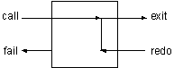

# 流程控制

在前面的章节中，我们了解了Prolog是如何解释目标的，并且通过实例说明了Prolog的运行流程。

在这一章，继续探索Prolog的程序流程控制，我们将介绍和一般的程序设计语言相似的流程控制。

前面我们使用谓词`fail`和`write/1`来列印出游戏中所有的物品。这种流程控制类似于一般语言中`“do，while”`语句。

现在介绍另外一个使用失败来完成相同功能的内部谓词---`repeat/0`。它在第一次调用时永远成功，并且在回溯时也永远成功。换句话说，流程不可能回溯通过`repeat/0`。


<div align=center style="align:center">
    
</div>


如果某个子句中有`repeat/0`，并且其后有`fail/0`谓词出现，那么将永远循环下去。使用这种方法可以编写死循环的Prolog程序。

如果在`repeat/0`谓词后面加入几个中间目标，并且最后使用一个测试条件结束，那么程序将一直循环到条件满足为止。这相当于其它程序语言中的`“do until”`。在编写`“寻找Nani”`这个游戏时，我们正好需要这种流程来编写最高层的命令循环。

我们先来看一个例子，它只是简单的读入命令并且在屏幕上回显出来，直到用户输入了`end`命令。内部谓词`read/1`可以从控制台对入一条Prolog字符串。此字符串必须使用`“.”`结束，就像所有的Prolog子句一样。

```prolog
command_loop:- 
    repeat,
    write('Enter command (end to exit): '),
    read(X),
    write(X), nl,
    X = end.
```

最后面的那个目标`x=end`只有在用户输入`end`时才会成功，而`repeat/0`在回溯时将永远成功，所以这种结构将使得中间的目标能够被重复执行。

下面我们要做的事就是加入中间的命令执行部分，而不是简单的回显用户输入的命令。

我们先来编写一个新的谓词`do/1`，它用来执行我们需要的谓词。在许多程序语言中，这种结构叫做`“do case”`，而在Prolog中我们使用多条子句来完成相同的功能。

下面是`do/1`的程序，我们可以使用`do/1`来定义命令的同义词，例如玩家可以输入`goto(X)`或者`go(X)`，这都将运行`goto(X)`子句。

```prolog
do(goto(X)):-
    goto(X),!.
do(go(X)):-
    goto(X),!.
do(inventory):-
    inventory,!.
do(look):-
    look,!.
```

此处的`cut`有两个用途。第一，如果我们找到了一条该执行的do子句，就没有必要去寻找更多的do子句了；第二，它有效地防止了在回溯时又重新运行`read`目标。

下面是另外的几条`do/1`的子句。如果没有`do(end)`子句，那么条件`X=end`就永远不会成立，所以`end`是结束游戏的命令。最后一个`do/1`子句考虑不合法的命令。

```prolog
do(take(X)) :- 
    take(X), !.
do(end).
do(_) :- 
    write('Invalid command').
```

下面我们开始正式编写`command_loop/0`谓词，这里使用前面说编写的`puzzle/1`和本章介绍的`do/1`谓词来完成命令的解释工作。并且我们将考虑游戏结束的情况，游戏有两种结束方式，可以是玩家输入了`end`命令，或者玩家找到了`Nani`。我们将编写一个新的谓词`end_condition/1`来完成这个任务。

```prolog
command_loop:- 
    write('Welcome to Nani Search'), nl,
    repeat,
    write('>nani> '),
    read(X),
    puzzle(X),
    do(X), nl,
    end_condition(X).
    end_condition(end).
end_condition(_) :-
    have(nani),
    write('Congratulations').
```

# 递归循环

在Prolog程序中使用`assert`和`retract`谓词动态地改变数据库的方法，不是纯逻辑程序的设计方法。就像其他语言中的全局变量一样，使用这种谓词会产生一些不可预测的问题。由于使用了这种谓词，可是会导致程序中两个本来应该独立的部分互相影响。

例如，`puzzle(goto(cellar))`的结果依赖于`turned_on(flashlight)`是否存在于数据库中，而`turned_on(flashlight)`是使用`turn_on`谓词动态地加入到数据库中的。所以如果`turn_on/1`中间有错误，它就会直接影响到`puzzle`，这中程序之间的隐形联系正是造成错误的罪魁祸首。

我们可以重新改造程序，只使用参数传递信息，而不是全局数据。可以把这种情况想象成一系列的状态转换。

在本游戏中，游戏的状态是使用`location/2`、`here/1`、`have/1`以及`turned_on/1(turned_off/1)`来定义的。我们首先使用这些谓词定义游戏的初始状态，其后玩家的操作将使用`assert`和`retract`动态地改变这些状态，直到最后达到了`have(nani)`。

我们可以通过定义一个复杂的结构来储存游戏的状态来完成相同的功能，游戏的命令将把这个结构当作参数进行操作，而不是动态数据库。

由于逻辑变量是不能通过赋值来改变它们的值的，所以所有的命令都必须有两个参数，一个是旧的状态，另一个实行的状态。使用前面的`repeat-fail`循环结构无法完成参数的传递过程，因此我们就使用递归程序把状态传给它自己，而边界条件则是到达了游戏的最终状态。下面的程序就是使用这种方法编制而成的。

游戏的状态使用列表储存，列表的每个元素就是我们前面所定义的状态谓词，请看`initial_state/1`谓词。而每个命令都要对这个列表有不同的操作，谓词`get_state/3`,` add_state/4`, 和`del_state/4`就是完成这个任务的，它们提供了操作状态列表的方法。 

这种Prolog程序就是纯逻辑的，它完全避免的使用全局数据的麻烦。但是它需要更复杂的谓词来操作参数中的状态。而列表操作与递归程序则是最难调试的了。至于使用哪种方法就要有你决定了。

```prolog
% a nonassertive version of nani search 
nani :-
    write('Welcome to Nani Search'),
    nl,
    initial_state(State),
    control_loop(State).
control_loop(State) :-
    end_condition(State).
control_loop(State) :-
    repeat,
    write('> '),
    read(X),
    constraint(State, X),
    do(State, NewState, X),
    control_loop(NewState).
    
% initial dynamic state 
initial_state([
    here(kitchen),
    have([]),
    location([
        kitchen/apple,
        kitchen/broccoli,
        office/desk,
        office/flashlight,
        cellar/nani ]),
    status([
    flashlight/off,
    game/on]) ]).

% static state 
rooms([office, kitchen, cellar]).
doors([office/kitchen, cellar/kitchen]).

connect(X,Y) :-
    doors(DoorList),
    member(X/Y, DoorList).
connect(X,Y) :-
    doors(DoorList),
    member(Y/X, DoorList).

% list utilities 
member(X,[X|Y]).
member(X,[Y|Z]) :- 
    member(X,Z).

delete(X, [], []).
delete(X, [X|T], T).
delete(X, [H|T], [H|Z]) :- 
    delete(X, T, Z).

% state manipulation utilities 
get_state(State, here, X) :-
    member(here(X), State).
get_state(State, have, X) :-
    member(have(Haves), State),
    member(X, Haves).
get_state(State, location, Loc/X) :-
    member(location(Locs), State),
    member(Loc/X, Locs).
get_state(State, status, Thing/Stat) :-
    member(status(Stats), State),
    member(Thing/Stat, Stats).

del_state(OldState, [location(NewLocs) | Temp], location, Loc/X):-
    delete(location(Locs), OldState, Temp),
    delete(Loc/X, Locs, NewLocs).
add_state(OldState, [here(X)|Temp], here, X) :-
    delete(here(_), OldState, Temp).
add_state(OldState, [have([X|Haves])|Temp], have, X) :-
    delete(have(Haves), OldState, Temp).
add_state(OldState, [status([Thing/Stat|TempStats])|Temp],
    status, Thing/Stat) :-
delete(status(Stats), OldState, Temp),
delete(Thing/_, Stats, TempStats).

% end condition 
end_condition(State) :-
    get_state(State, have, nani),
    write('You win').
end_condition(State) :-
    get_state(State, status, game/off),
    write('quitter').

% constraints and puzzles together 
constraint(State, goto(cellar)) :-
    !, can_go_cellar(State).
constraint(State, goto(X)) :-
    !, can_go(State, X).
constraint(State, take(X)) :-
    !, can_take(State, X).
constraint(State, turn_on(X)) :-
    !, can_turn_on(State, X).
constraint(_, _).

can_go(State,X) :-
    get_state(State, here, H),

connect(X,H).

can_go(_, X) :-
    write('You can''t get there from here'),
    nl, fail.
can_go_cellar(State) :-
    can_go(State, cellar),
    !, cellar_puzzle(State).

cellar_puzzle(State) :-
    get_state(State, have, flashlight),
    get_state(State, status, flashlight/on).
cellar_puzzle(_) :-
    write('It''s dark in the cellar'),
    nl, fail.

can_take(State, X) :-
    get_state(State, here, H),
    get_state(State, location, H/X).
can_take(State, X) :-
    write('it is not here'),
    nl, fail.

can_turn_on(State, X) :-
    get_state(State, have, X).
can_turn_on(_, X) :-
    write('You don''t have it'),
    nl, fail.

% commands 
do(Old, New, goto(X)) :-
    goto(Old, New, X), !.
do(Old, New, take(X)) :-
    take(Old, New, X), !.
do(Old, New, turn_on(X)) :- 
    turn_on(Old, New, X), !.
do(State, State, look) :- 
    look(State), !.
do(Old, New, quit) :- 
    quit(Old, New).
do(State, State, _) :-
    write('illegal command'), nl.

look(State) :-
    get_state(State, here, H),
    write('You are in '), write(H),
    nl,
    list_things(State, H), nl.

list_things(State, H) :-
    get_state(State, location, H/X),
    tab(2), write(X),
    fail.
list_things(_, _).

goto(Old, New, X) :-
    add_state(Old, New, here, X),
    look(New).

take(Old, New, X) :-
    get_state(Old, here, H),
    del_state(Old, Temp, location, H/X),
    add_state(Temp, New, have, X).

turn_on(Old, New, X) :-
    add_state(Old, New, status, X/on).

quit(Old, New) :-
    add_state(Old, New, status, game/off).
```

使用这种递归的方法来完成任务，还有一个问题需要考虑。Prolog需要使用堆栈来储存递归的一些中间信息，当递归深入下去时，堆栈会越来越大。在本游戏中，由于参数较为复杂，堆栈是很容易溢出的。

幸运的是，Prolog对于这种类型的递归有优化的方法。

# 尾递归

递归有两种类型。在真正的递归程序中，每一层必须使用下一层调用返回的信息。这意味着Prolog必须建立堆栈来储存每一层的信息。

这与重复操作是不同的，在通常的语言中，我们一般使用的是重复操作。重复操作只需要把信息传递下去就行了，而不需要保存每一次调用的信息。我们可以使用递归来实现重复，这种递归就叫做尾递归。它的通常的形式是递归语句在最后，每一层的计算不需要使用下一层的返回信息，所以在这种情况下，好的Prolog解释器不需要使用堆栈。

计算阶乘就属于尾递归类型。首先我们使用通常的递归形式。注意从下一层返回的变量FF的值被使用到了上一层。

```prolog
factorial_1(1,1).
factorial_1(N,F):-
    N > 1,
    NN is N - 1,
    factorial_1(NN,FF),
    F is N FF.
```
```prolog
?- factorial_1(5,X).
X = 120
```

如果引入一个新的变量来储存前面调用的结果，我们就可以把`factorial/3`写成尾递归的形式。新的参数的初始值为1。每次递归调用将计算第二个参数的值，当到达了边界条件，第三个参数就绑定为第二个参数。

```prolog
factorial_2(1,F,F).
factorial_2(N,T,F):-
    N > 1,
    TT is N T,
    NN is N - 1,
    factorial_2(NN,TT,F).
```
```prolog
?- factorial_2(5,1,X).
X = 120
```

它的结果和前面的相同，不过由于使用了尾递归，就不需要使用堆栈来储存中间的信息了。

把列表的元素顺序倒过来的谓词也可以使用尾递归来完成。

```prolog
naive_reverse([],[]).
naive_reverse([H|T],Rev):-
    naive_reverse(T,TR),
    append(TR,[H],Rev).
```
```prolog
?- naive_reverse([ants, mice, zebras], X).
X = [zebras, mice, ants]
```

这个谓词在逻辑上是完全正确的，不过它的运行效率非常低。所以我们把它叫做`原始(naive)`的递归。

当引入一个用来储存部分运算结果的新的参数后，我们就可以使用尾递归来重写这个谓词。

```prolog
reverse([], Rev, Rev).
reverse([H|T], Temp, Rev) :-
    reverse(T, [H|Temp], Rev).
```
```prolog
?- reverse([ants, mice, zebras], [], X).
X = [zebras, mice, ants]
```