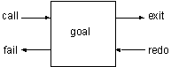

# 简单查询
现在我们的游戏中已经有了一些事实，使用`Prolog`的解释器调入此程序后，我们就可以对这些事实进行查询了。本章和下一章中的`Prolog`程序只包括事实，我们要学会如何对这些事实进行查询。

`Prolog`的查询工作是靠模式匹配完成的。查询的模板叫做目标`(goal)`。如果有某个事实与目标匹配，那么查询就成功了，`Prolog`的解释器会回显`'yes.'`。如果没有匹配的事实，查询就失败了，解释器回显`'no.'`。

我们把`Prolog`的模式匹配工作叫做联合`(unification)`。当数据库中只包括事实时，以下三个条件是使联合成功的必要条件。

- 目标谓词名与数据库中的某个谓词名相同。
- 这两个谓词的参数数目相同。
- 所有的参数也相同。

在介绍查询之前，让我们回顾一下上一章所编写的`Prolog`程序。
```prolog
room(kitchen).
room(office).
room(hall).
room('dining room').
room(cellar).

door(office,hall).
door(kitchen,office).
door(hall,'dining room').
door(kitchen,cellar).
door('dining room',kitchen).

location(desk,office).
location(apple,kitchen).
location(flashlight,desk).
location('washing machine',cellar).
location(nani,'washing machine').
location(broccoli,kitchen).
location(crackers,kitchen).
location(computer,office).

edible(apple).
edible(crackers).
tastes_yucky(broccoli).

here(kitchen).
```
以上是我们的`“寻找Nani”`中的所有事实。把这段程序调入`Prolog`解释器中后就可以开始进行查询了。

我们的第一个问题是：`office`在本游戏中是不是一个房间。
```js
?-room(office). 
yes. 
```
`Prolog`回答`yes`，因为它在数据库中找到了`room(office).`这个事实。我们继续问：有没有`attic`这个房间。
```
?-room(attic).
no.
```

`Prolog`回答`no`，因为它在数据库中找不到`room(attic).`这个事实。同样我们还可以进行如下的询问。
```js
?- location(apple, kitchen).
yes 

?- location(kitchen, apple).
no 
```
你看`Prolog`懂我们的意思呢，它知道苹果在厨房里，并且知道厨房不在苹果里。但是下面的询问就出问题了。
```js
?- door(office, hall). 
yes 

?- door(hall, office).
no 
```
由于我们定义的门是单方向的，结果遇到了麻烦。

在查询目标中我们还可以使用`Prolog`的变量。这种变量和其他语言中的不同。叫它逻辑变量更合适一点。变量可以代替目标中的一些参数。

变量给`联合`操作带来了新的意义。以前联合操作只有在谓词名和参数都相同时才能成功。但是引入了变量之后，变量可以和任何的条目匹配。

当联合成功之后，变量的值将和它所匹配的条目的值相同。这叫做变量的绑定`(binding)`。当带变量的目标成功的和数据库中的事实匹配之后，`Prolog`将返回变量绑定的值。

由于变量可能和多个条目匹配，`Prolog`允许你察看其他的绑定值。在每次`Prolog`的回答后输入“；”，可以让`Prolog`继续查询。下面的例子可以找到所有的房间。“；”是用户输入的。

```js
?- room(X).
X = kitchen ;
X = office ;
X = hall ; 
X = 'dining room' ;
X = cellar ;
no
```

最后的`no`表示找不到更多的答案了。

下面我们想看看`kitchen`中都有些什么。（变量以大写字母开始）
```js
?- location(Thing, kitchen).
Thing = apple ;
Thing = broccoli ; 
Thing = crackers ;
no 
```
我们还可以使用两个变量来查询所有的物体及其位置。
```js
?- location(Thing, Place).
Thing = desk 
Place = office ;

Thing = apple
Place = kitchen ;

Thing = flashlight 
Place = desk ;
//...
no
```

## 查询的工作原理

当`Prolog`试图与某一个目标匹配时，例如：`location/2`，它就在数据库中搜寻所有用`location/2`定义的子句，当找到一条与目标匹配时，它就为这条子句作上记号。当用户需要更多的答案时，它就从那条作了记号的子句开始向下查询。

我们来看一个例子，用户询问：`location`（`X`，`kitchen`）`.`。`Prolog`找到数据库中的第一条`location/2`子句，并与目标比较。

目标` location(X, kitchen) `
<br>子句`#1 location(desk, office) `

匹配失败，因为第二个参数不同，一个是`kitchen`，一个是`office`。于是`Prolog`继续比较第二个子句。

目标` location(X, kitchen)`
<br>子句`#2 location(apple, kitchen) `

这回匹配成功，而变量`X`的值就被绑定成了`apple`。
```js
?- location(X, kitchen).
X = apple 
```
如果用户输入分号`(;)`，`Prolog`就开始寻找其他的答案。首先它必须释放（`unbinds`）变量`X`。然后从上一次成功的位置的下一条子句开始继续搜索。这个过程叫做回溯（`backtracking`）。在本例中就是第三条子句。

目标` location(X, kitchen)`
<br>子句`#3 location(flashlight, desk) `

匹配失败，直到第六条子句时匹配又成功了。

目标` location(X, kitchen) `
<br>子句`#6 location(broccoli, kitchen) `

结果变量`X`又被绑定为`broccoli`，解释器显示：
```js
X = broccoli ; 
```
再度输入分号，`X`又被解放，开始新的搜索。又找到了：
```js
X = crackers ; 
```
这回再没有新的子句能够匹配了，于是`Prolog`回答`no`，表示最后一次搜索失败了。
```js
no
```
要想了解`Prolog`的运行顺序，最好的方法就是`单步调试程序`，不过在此之前，还是让我们加深一下对目标的认识吧。

`Prolog`的目标有四个端口用来控制运行的流程：调用（`call`）、退出（`exit`）、重试（`redo`）以及失败（`fail`）。一开始使用`Call`端口进入目标，如果匹配成功就到了`exit`端口，如果失败就到了`fail`端口，如果用户输入分号，则又从`redo`端口进入目标。下图表示了目标和它的四个端口。

<div align=center style="align:center">
    
</div>

每个端口的功能如下：

- `call `开始使用目标搜寻子句。
- `exit `目标匹配成功，在成功的子句上作记号，并绑定变量。
- `redo `试图重新满足目标，首先释放变量，并从上次的记号开始搜索。
- `fail `表示再找不到更多的满足目标的子句了。

下面列出了调试`location(X,kitchen).`时的情况。括号中的数字表示当前正在考虑的子句。
```js
?- location(X, kitchen).
CALL: - location(X, kitchen)
EXIT:(2) location(apple, kitchen)
X = apple;

REDO: location(X, kitchen) 
EXIT:(6) location(broccoli, kitchen)
X = broccoli ;

REDO: location(X, kitchen)
EXIT:(7) location(crackers, kitchen) 
X = crackers ; 

FAIL - location(X, kitchen)
no 
```

## Debug

在`Prolog`的解释器中输入，
```js
?- debug. 
```
就可以开始调试你的程序了。

