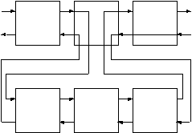

# 规则

前面我们已经说过，谓词是使用一系列的子句来定义的。以前我们所学习的子句是事实，现在让我们来看看规则吧。规则的实质就是储存起来的查询。它的语法如下：
```js
head :- body
```
其中，
- `head `是谓词的定义部分，与事实一样，也包括谓词名和谓词的参数说明。
- `:- `连接符，一般可以读作‘如果’。
- `body `一个或多个目标，与查询相同。

举个例子，上一章中的混合查询`--`找到能吃的东西和它所在的房间，可以使用如下的规则保存，规则名为`where_food/2`。

```prolog
where_food(X,Y) :- 
        location(X,Y),
        edible(X). 
```

用语言来描述就是“在房间`Y`中有可食物`X`的条件是：`X`在`Y`房间中，并且`X`可食。”

我们现在可以直接使用此规则来找到房间中可食的物品。

```js
?- where_food(X, kitchen). 
X = apple ;
X = crackers ;
no 

?- where_food(Thing, 'dining room').
no 
```
它也可以用来判断，
```js
?- where_food(apple, kitchen).
yes 
```
或者通过它找出所有的可食物及其位置，
```js
?- where_food(Thing, Room). 
Thing = apple
Room = kitchen ; 

Thing = crackers
Room = kitchen ;
no 
```
我们可以使用多个事实来定义一个谓词，同样我们也可以用多个规则来定义一个谓词。例如，如果想让`Prolog`知道`broccoli`（椰菜）也是可食物，我们可以如下定义`where_food/2`规则。
```prolog
where_food(X,Y) :- 
        location(X,Y),
        edible(X).
where_food(X,Y) :- 
        location(X,Y), 
        tastes_yucky(X).
```
在以前的事实中我们没有把`broccoli`定义为`edible`，即没有`edible(broccoli).`这个事实，所以单靠`where_food`的第一个子句是不能找出`broccoli`的，但是我们曾在事实中定义过：`tastes_yucky(broccoli).`，所以如果加入第二个子句，`Prolog`就可以知道`broccoli`也是`food`（食物）了。下面是它的运行结果。
```js
?- where_food(X, kitchen). 
X = apple ; 
X = crackers ;
X = broccoli ;
no 
  ```

## 规则的工作原理

到现在为止，我们所知道的`Prolog`所搜索的子句只有事实。下面我们来看看`Prolog`是如何搜索规则的。

首先，`Prolog`将把目标和规则的子句的头部（`head`）进行匹配，如果匹配成功，`Prolog`就把此规则的`body`部分作为新的目标进行搜索。

实际上规则就是多层的询问。第一层由原始的目标组成，从下一层开始就是由与第一层的目标相匹配的规则的`Body`中的`子目标`组成。（这句话有点难理解，请参照下面图来分析）

<div align=center style="align:center">
    
</div>

每一层还可以有`子目标`，理论上来讲，这种目标的嵌套可以是无穷的。但是由于计算机的硬件限制，`子目标`只可能有有限次嵌套。

上图显示了这种目标嵌套的流程图，请你注意第一层的第三个目标是如何把控制权回溯到第二层的`子目标`中的。

在这个例子中，第一层的中间的那个目标的结果依赖于第二层的目标的结果。此目标会把程序的控制权传给他的`子目标`。

下面我们详细地分析一下`Prolog`在匹配有规则的子句时是如何工作的。请注意用`‘-’`分隔的两个数字，第一个数字代表当前的目标级数，第二个数字代表当前目标层中正在匹配的目标的序号。例如：
```js
2-1 EXIT (7) location(crackers, kitchen) 
```
表示第二层的第一个目标的`EXIT`过程。

我们的询问如下
```js
?- where_food(X, kitchen).
```
首先我们寻找有`where_food/2`的子句. 
```js
1-1 CALL where_food(X, kitchen) 
```
与第一个子句的头匹配 
```js
1-1 try (1) where_food(X, kitchen) ;
```
第一个`where_food/2`的子句与目标匹配。

于是第一个子句的`Body`将变为新的目标。
```js
2-1 CALL location(X, kitchen) 
```
从现在起的运行过程就和我们以前一样了。
```js
2-1 EXIT (2) location(apple, kitchen)
2-2 CALL edible(apple)
2-2 EXIT (1) edible(apple) 
```
由于`Body`的所有目标都成功了，所以第一层的目标也就成功了。
```js
1-1 EXIT (1) where_food(apple, kitchen) 
X = apple ; 
```
第一层的回溯过程使得又重新进入了第二层的目标。 
```js
1-1 REDO where_food(X, kitchen) 
2-2 REDO edible(apple)
2-2 FAIL edible(apple) 
2-1 REDO location(X, kitchen)
2-1 EXIT (6) location(broccoli, kitchen) 
2-2 CALL edible(broccoli)
2-2 FAIL edible(broccoli)
2-1 REDO location(X, kitchen)
2-1 EXIT (7) location(crackers, kitchen)
2-2 CALL edible(crackers) 
2-2 EXIT (2) edible(crackers)
1-1 EXIT (1) where_food(crackers, kitchen)
X = crackers ; 
```
下面就没有更多的答案了，于是第一层的目标失败。 
```js
2-2 REDO edible(crackers) 
2-2 FAIL edible(crackers)
2-1 REDO location(X, kitchen) 
2-1 FAIL location(X, kitchen)
```
下面`Prolog`开始寻找另外的子句，看看它们的头部（`head`）能否与目标匹配。在此例中，`where_food/2`的第二个子句也可以与询问匹配。
```js
1-1 REDO where_food(X, kitchen) 
```
`Prolog`又开始试图匹配第二个子句的`Body`中的目标。
```js
1-1 try (2) where_food(X, kitchen) ;
```
第二个`where_food/2`的子句与目标匹配。

下面将找到不好吃的椰菜。即` tastes_yucky `的` broccoli.`
```js
2-1 CALL location(X, kitchen) 
2-1 EXIT (2) location(apple, kitchen) 
2-2 CALL tastes_yucky(apple) 
2-2 FAIL tastes_yucky(apple) 
2-1 REDO location(X, kitchen) 
2-1 EXIT (6) location(broccoli, kitchen) 
2-2 CALL tastes_yucky(broccoli)
2-2 EXIT (1) tastes_yucky(broccoli) 
1-1 EXIT (2) where_food(broccoli, kitchen) 
X = broccoli ; 
```
回溯过程将让`Prolog`寻找另外的`where_food/2`的子句。但是，这次它没有找到。
```js
2-2 REDO tastes_yucky(broccoli) 
2-2 FAIL tastes_yucky(broccoli) 
2-1 REDO location(X,kitchen) 
2-1 EXIT (7) location(crackers, kitchen) 
2-2 CALL tastes_yucky(crackers) 
2-2 FAIL tastes_yucky(crackers) 
2-2 REDO location(X, kitchen) 
2-2 FAIL location(X, kitchen) 
1-1 REDO where_food(X, kitchen) ;
```
没有找到更多的`where_food/2`的子句了。
```js
1-1 FAIL where_food(X, kitchen)
no 
```
在询问的不同层的目标中，即是相同的变量名称也是不同的变量，因为它们都是局部变量。这于其他语言中的局部变量是差不多的。

我们再来分析一下上面的那个例子吧。
```prolog
where_food(X,Y) :- 
        location(X,Y),
        edible(X). 
```
查询的目标是：
```js
?- where_food(X1, kitchen) 
```
第一个子句的头是：
```prolog
where_food(X2, Y2) 
```
目标和子句的头部匹配，在`Prolog`中如果变量和原子匹配，那么变量就绑定为此原子的值。如果两个变量进行了匹配，那么这两个变量将同时绑定为一个内部变量。此后，这两个变量中只要有一个绑定为了某个原子的值，另外一个变量也会同时绑定为此值。所以上面的匹配操作将有如下的绑定。
```prolog
X1 = _01 ; % 01 为Prolog的内部变量。
X2 = _01
Y2 = kitchen
```
于是当上述的匹配操作完成后，规则`where_food/2`的`body`将变成如下的查询：
```prolog
location(_01, kitchen), edible(_01).
```
当内部变量取某值时，例如`'apple'`，`X1`和`X2`将同时绑定为此值，这是`Prolog`变量和其他语言的变量的基本的区别。如果你学过`C`语言，容易看出，实际上`X1`和`X2`都是指针变量，当它们没有绑定值时，它们的值为`NULL`，一旦绑定，它们就会指向某个具体的位置，上例中它们同时指向了`_01`这个变量，其实`_01`变量还是个指针，直到最后某个指针指向了具体的值，那么所有的指针变量就都被绑定成了此值。

## 使用规则
使用规则我们可以很容易的解决单向门的问题。我们可以再定义有两个子句的谓词来描述这种双向的联系。此谓词为`connect/2`。
```prolog
connect(X,Y) :- 
        door(X,Y). 
connect(X,Y) :- 
        door(Y,X).
```
它代表的意思是“房间`X`和`Y`相连的条件是：从`X`到`Y`有扇门，或者从`Y`到`X`有扇门`"`。请注意此处的或者，为了描述这种或者的关系我们可以为某个谓词定义多个子句。
```js
?- connect(kitchen, office). 
yes 

?- connect(office, kitchen).
yes 
```
我们还可以让`Prolog`列出所有相连的房间。
```js
?- connect(X,Y).
X = office 
Y = hall ;

X = kitchen 
Y = office ;

...
X = hall 
Y = office ; 

X = office
Y = kitchen ;
// ... 
```
使用我们现在所具有的知识，我们可以为“搜索`Nani`”加入更多的谓词。首先我们定义`look/0`，它能够显示玩家所在的房间，以及此房间中的物品和所有的出口。

先定义`list_things/1`，它能够列出某个房间中的物品。
```prolog
list_things(Place) :- 
        location(X, Place), 
        tab(2), 
        write(X),
        nl,
        fail. 
```
它和上一章中的最后一个例子差不多。我们可以如下使用它。
```js
?- list_things(kitchen).
apple 
broccoli
crackers 
no 
```
这地方有一个小问题，它虽然把所有的东西都列出来了，但是最后那个`no`不太好看，并且如果我们把它和其他的规则连起来用时麻烦就更大了，因为此规则的最终结果都是`fail`。实际上它是我们扩充的`I/O`谓词，所以它应该总是成功的。我们可以很容易的解决这个问题。
```prolog
list_things(Place) :- 
        location(X, Place),
        tab(2),
        write(X),
        nl, fail. 
list_things(AnyPlace). 
```
如上所示，加入`list_things(AnyPlace)`子句后就可以解决了，第一个`list_things/1`的子句把所有的物品列出，并且失败，而由于第二个子句永远是成功的，所以`list_things/1`也将是成功的。`AnyPlace`变量的值我们并不关心，所以我们可以使用无名变量‘`_`’来代替它。
```js
list_things(_). 
```
下面我们来编写`list_connections/1`，它能够列出与某个房间相连的所有房间。

```prolog
list_connections(Place) :- 
        connect(Place, X),
        tab(2),
        write(X),
        nl, 
        fail.
        
list_connections(_).
```

我们来试试功能，
```js
?- list_connections(hall). 
        dining
        room
        office 
true.
```
终于可以来编写`look/0`了，
```prolog
look :-
        here(Place),
        write('You are in the '), 
        write(Place), 
        nl,
        write('You can see:'), 
        nl,
        list_things(Place), 
        write('You can go to:'),
        nl,
        list_connections(Place). 
```
在我们定义的事实中有`here(kitchen).`它代表玩家所在的位置。以后我们将学习如何改变此事实。现在来试是功能吧，
```js
?- look.
You are in the kitchen
You can see:
  apple
  broccoli
  crackers
You can go to:
  office
  cellar
  dining room
true.
```
好了到此，我们已经学会了`Prolog`的基本编程方法，下一章将总结一下，并再举几个例子，此后我们将进入较深的学习。